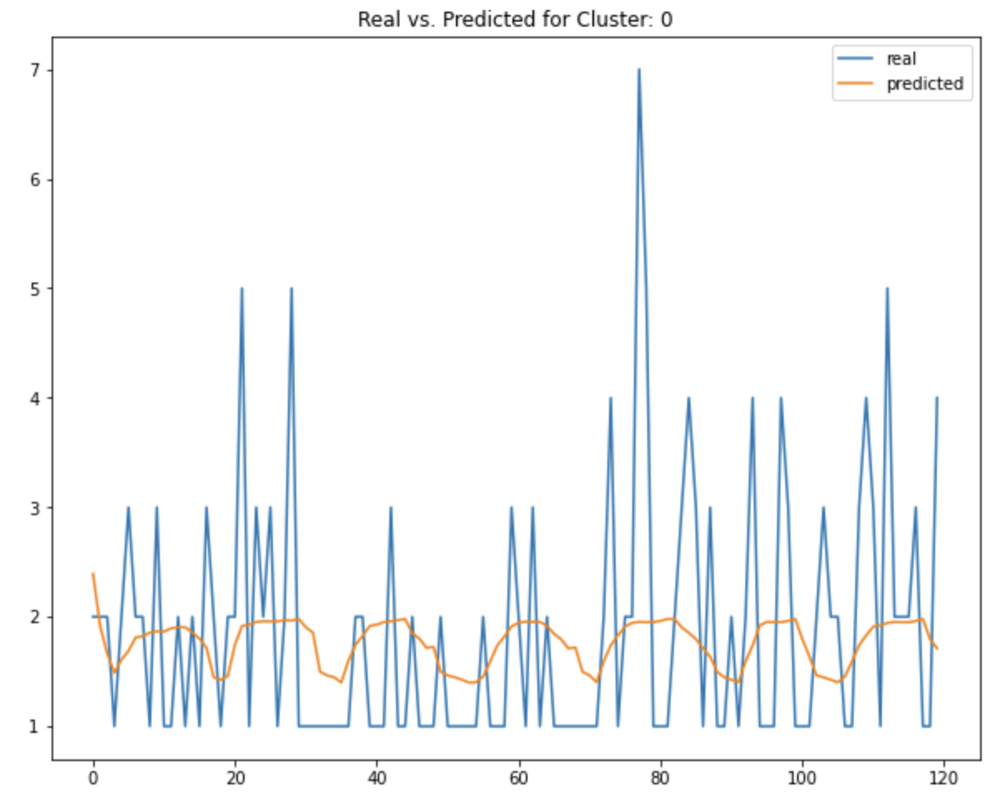
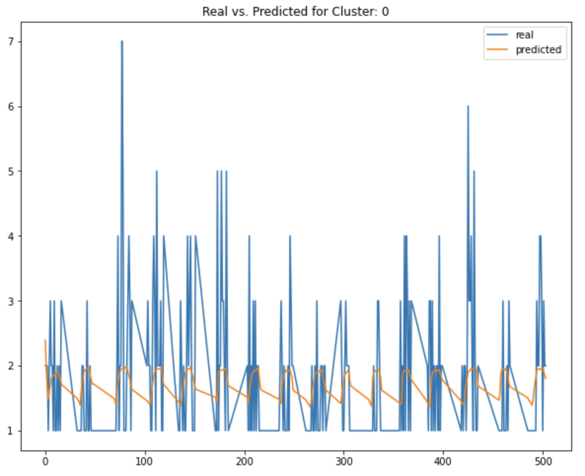

# seattle-calls
Repository containing predictive modelling code for Seattle 911 calls

# Requirements 
Found in `requirements.txt`

# Running application
For training, run `train.py`. Note that this requires BigQuery authentication, so the train file will not run unless configured with a BigQuery project that you have access to. 

Command line arguments:

- `--include_hour`: whether to include the hour variable. The serialized model objects will contain a flag `False` or `True` depending on whether this is used at training or not
- `--credentials_path`: path for json key used for querying google cloud. I used the data stored in BigQuery for training but obviously you will not have access to this
- `--project_id`: project id in google cloud
- Note: if `--credentials_path` is not passed when running, then the training defaults to using the dummy data I stored in `data/input`. This just contains two years of training data but I just placed it there to prove my code works

Example usage:
```
python src/train.py --include_hour --credentials_path '<path_to_credentials>' --project_id '<google_cloud_project_id>'
```

For inference, run `inference.py`. This is set up such that two different options can be used:

- Querying inference data from BigQuery (unavailable unless you configure it) which is reliant on passing `--credentials_path` and `project_id` command line arguments
- Loading a csv file from `data/input/`

Example usage:
```
python src/inference.py --include_hour --credentials_path '<path_to_credentials>' --project_id '<google_cloud_project_id>'
```

The inference pipeline will be run for the input dataframe and results will be saved in `data/output/`. The filename will contain a timestamp.

# Main findings

- Note that deeper investigation can be found in the supplementary notebook in `notebooks/Seattle_Calls.ipynb`. This is where my initial development and modelling was done.

- The gradient boosted regressor appears to perform well, however it is difficult to take into account the highly volatile nature of the data

- R2 and RMSE were the main metrics used for assessing model output

- Introducing the geographical cluster greatly improved the accuracy

Week forecast for one cluster:


Obviously since this is also incorporating hour into the model, the volatility of the calls is going to be much higher, thus making it harder to predict call volume. I think that this is a helpful way to forecast how many dispatchers should be on duty. There is clearly a trend in call volume which can especially be seen over the course of the month.

Month forecast for the same cluster:


# Further Work

What I would intend on working on given more time would be:

- More unit testing: there is a test which should fail, given that credentials can only be utilised at the moment by me. Also I would implement more unit tests to test other parts of the code.

- Testing of more regression models. I believe that implementation of an LSTM network for example would greatly benefit the quality of the prediction, since history is taken into acccount and this would likely also factor in any seasonal influence

- Further investigation of loss functions and target values. At the moment I have assessed it mainly using the R2 value. I also looked at the RMSE value, and the model appears to do fine, however I think that further refinement and hyperparameter tuning could give better prediction quality

- Incorporation of external data like weather

- Streaming of live data using the API available on the website. This could then be fed into the model and give live forecasting results